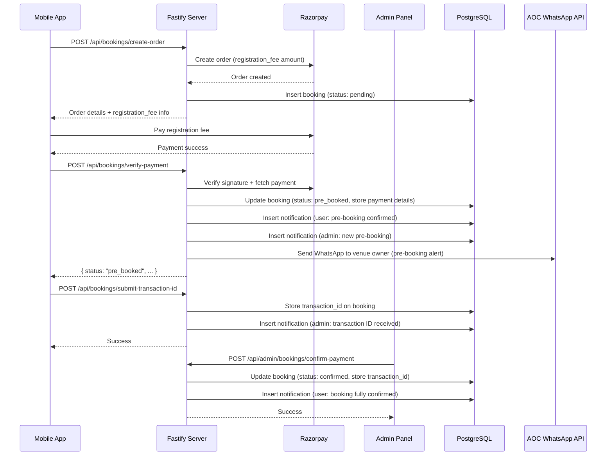

# Design Document: Venue Pre-Booking

## Overview

This design introduces a two-phase payment workflow into the existing venue booking system. When a venue has a `registration_fee > 0`, the user pays only the registration fee via Razorpay to secure a "pre-booking." An admin agent then contacts the user to collect the remaining balance manually. Once the admin confirms receipt of the full payment (with a transaction ID), the booking transitions to "confirmed."

The design modifies the existing `verify-payment` endpoint behavior, adds new API endpoints for transaction ID submission and admin payment confirmation, extends the database schema, and updates both the mobile app and admin panel UIs.

### Key Design Decisions

1. **Mandatory registration fee** — Every venue must have a `registration_fee > 0`. No venue can be approved/published without it. This means the pre-booking flow is the only booking path — there is no "direct full payment" path.
2. **Reuse existing Razorpay flow** — The `create-order` endpoint already calculates `paymentAmount` based on `registration_fee`. We modify `verify-payment` to always set status `pre_booked` (since all venues now have a registration fee).
3. **Transaction ID as proof** — Rather than integrating a second payment gateway, the remaining balance is collected manually and tracked via a free-text transaction ID field.
4. **Admin-driven confirmation** — Only admins can transition a booking from `pre_booked` to `confirmed`, ensuring manual payment verification.
5. **Notification-driven coordination** — Push + in-app notifications keep the user and admin in sync throughout the two-phase flow.
6. **Data migration for existing venues** — A one-time migration script assigns random registration fees (₹1,000–₹5,000) to existing venues that have zero/null fees, ensuring no venues disappear from the mobile app.

## Architecture



## Components and Interfaces

### API Endpoints

#### Modified: `POST /api/bookings/verify-payment`

**Change**: Since all venues now have `registration_fee > 0`, this endpoint always sets status to `pre_booked`. Store `registration_fee_paid` and `remaining_balance` on the booking record.

**Request** (unchanged):
```json
{
  "order_id": "order_xxx",
  "payment_id": "pay_xxx",
  "signature": "hmac_signature",
  "booking_id": "uuid"
}
```

**Response** (extended):
```json
{
  "success": true,
  "message": "Pre-booking confirmed. Our agent will contact you.",
  "booking": { "...booking with status pre_booked..." },
  "is_pre_booking": true,
  "registration_fee_paid": 5000,
  "remaining_balance": 15000
}
```

#### New: `POST /api/bookings/submit-transaction-id`

**Auth**: User JWT required. User must own the booking.

**Request**:
```json
{
  "booking_id": "uuid",
  "transaction_id": "string (max 64 chars, alphanumeric + hyphens)"
}
```

**Validation**:
- `transaction_id` must be 1–64 characters
- Only alphanumeric characters, hyphens, and underscores allowed
- Booking must have status `pre_booked`
- Booking must belong to authenticated user

**Response**:
```json
{
  "success": true,
  "message": "Transaction ID submitted successfully"
}
```

#### New: `POST /api/admin/bookings/confirm-payment`

**Auth**: Admin/Owner JWT required.

**Request**:
```json
{
  "booking_id": "uuid",
  "transaction_id": "string (max 64 chars)"
}
```

**Validation**:
- `transaction_id` must be 1–64 characters
- Only alphanumeric characters, hyphens, and underscores allowed
- Booking must have status `pre_booked`

**Response**:
```json
{
  "success": true,
  "message": "Booking fully confirmed",
  "booking": {
    "id": "uuid",
    "status": "confirmed",
    "venue_name": "Grand Royal Wedding Hall",
    "booking_date": "2026-06-15",
    "start_time": "08:00 AM",
    "end_time": "12:00 PM",
    "guests": 100,
    "registration_fee_paid": 5000,
    "remaining_balance": 15000,
    "total": 20000,
    "transaction_id": "TXN123456",
    "confirmed_at": "2026-06-01T10:30:00Z"
  }
}
```

**Side Effects**:
1. Updates booking status to `confirmed` and stores `transaction_id`
2. Sets `paid_at` timestamp to current time
3. Creates in-app notification for user with full booking details (venue name, date, session, guests, total, transaction ID)
4. Sends push notification to user with title "Booking Fully Confirmed"
5. The notification data payload includes `booking_id` and `venue_id` for deep-linking to booking details

#### Modified: Razorpay Webhook `handlePaymentCaptured`

**Change**: Since all venues have registration fees, `handlePaymentCaptured` always sets booking status to `pre_booked` instead of `confirmed`. Create appropriate pre-booking notifications.

#### New: Venue Approval Validation

**Change to venue creation/approval endpoints**: The server rejects venue creation or approval when `registration_fee` is missing or zero.

- `POST /api/venues` — Validate `registration_fee > 0` before insert
- `POST /api/venues/:id/approve` — Validate `registration_fee > 0` before approval
- `POST /api/owners/venues` — Validate `registration_fee > 0` before insert

**Error Response**:
```json
{
  "error": "Registration fee is required",
  "message": "A registration fee greater than zero must be set before the venue can be published."
}
```

#### New: WhatsApp Notification to Venue Owner

**Trigger**: Called within `verify-payment` after booking is marked as `pre_booked`.

**Implementation**: Reuses the existing AOC WhatsApp API integration (same as `sendWhatsAppOTP`). A new function `sendWhatsAppPreBookingAlert` sends a template message to the venue owner.

```javascript
async function sendWhatsAppPreBookingAlert(ownerPhone, templateParams) {
  try {
    const response = await fetch('https://api.aoc-portal.com/v1/whatsapp', {
      method: 'POST',
      headers: {
        'apikey': process.env.AOC_API_KEY,
        'Content-Type': 'application/json'
      },
      body: JSON.stringify({
        from: process.env.AOC_WHATSAPP_NUMBER,
        to: ownerPhone,
        templateName: process.env.AOC_PREBOOKING_TEMPLATE_NAME || 'prebooking_alert',
        type: 'template',
        language: { code: 'en' },
        // Template parameters (to be finalized with actual template)
        params: templateParams
      })
    });

    const result = await response.json();
    if (!response.ok || result.error) {
      fastify.log.error('WhatsApp Pre-Booking Alert Error:', result);
      return false;
    }
    return true;
  } catch (err) {
    fastify.log.error('WhatsApp Pre-Booking Alert Error:', err.message);
    return false;
  }
}
```

**Environment Variables** (new):
- `AOC_PREBOOKING_TEMPLATE_NAME` — WhatsApp template name for pre-booking alerts (to be configured later)

**Behavior**:
- Fire-and-forget: failure does not block the pre-booking response
- Owner phone is fetched via `venues.owner_id → owners.phone_number`
- If venue has no owner_id or owner has no phone, skip silently with a log warning

### Mobile App Components

| Component | File | Changes |
|-----------|------|---------|
| BookingDetailScreen | `app/booking-detail.tsx` | Display "Pay Now" (registration fee) vs "Balance Due (via Agent)" in summary |
| PreBookingConfirmedScreen | `app/pre-booking-confirmed.tsx` (new) | New screen showing pre-booking success + next steps |
| ViewBookingScreen | `app/view-booking.tsx` | Add progress indicator for pre_booked status, transaction ID input, and complete booking confirmation card for confirmed status |
| BookingConfirmedScreen | `app/booking-confirmed.tsx` | Removed/unused — all bookings now go through pre-booking flow |

#### ViewBookingScreen: Confirmed State UI

When a booking has status `"confirmed"`, the screen displays:

1. **Green "Booking Confirmed" badge** with checkmark icon at the top
2. **Complete booking summary card** containing:
   - Venue name and image
   - Booking date and session time
   - Number of guests
   - Payment breakdown: registration fee paid + remaining balance paid = total
   - Transaction ID reference
   - Confirmation timestamp
3. **No progress indicator** — replaced by the confirmation card
4. **No transaction ID input** — hidden once confirmed

The screen auto-refreshes booking data on focus (using `useFocusEffect`) to detect admin-side status changes without requiring manual pull-to-refresh.

### Admin Panel Components

| Component | File | Changes |
|-----------|------|---------|
| OwnerBookingsPage | `admin/src/features/owner-portal/owner-bookings.tsx` | Add "Pre-Booked" badge, show registration fee/balance columns, add "Confirm Payment" action |
| ConfirmPaymentDialog | `admin/src/features/owner-portal/confirm-payment-dialog.tsx` (new) | Modal with transaction ID input + confirm button |

## Data Models

### Schema Changes (bookings table)

```javascript
// New columns added to the bookings table in schema.js
export const bookings = pgTable('bookings', {
  // ... existing columns ...
  transaction_id: varchar('transaction_id', { length: 64 }),
  registration_fee_paid: real('registration_fee_paid').default(0),
  remaining_balance: real('remaining_balance').default(0),
});
```

### Migration SQL

```sql
-- Bookings table: new columns for pre-booking workflow
ALTER TABLE bookings ADD COLUMN transaction_id VARCHAR(64);
ALTER TABLE bookings ADD COLUMN registration_fee_paid REAL DEFAULT 0;
ALTER TABLE bookings ADD COLUMN remaining_balance REAL DEFAULT 0;
```

### Data Migration: Existing Venues Registration Fee

A one-time migration script (`admin/server/migrate-registration-fees.js`) updates all existing venues with zero/null registration fees to random values between ₹1,000 and ₹5,000.

```javascript
// Pseudocode for migration script
// 1. SELECT all venues WHERE registration_fee IS NULL OR registration_fee = 0
// 2. For each venue, generate random fee: Math.floor(Math.random() * 4000) + 1000
// 3. UPDATE venue SET registration_fee = randomFee
// 4. Log: "Updated venue {name} (id: {id}) → registration_fee: ₹{fee}"
// 5. Log summary: "Updated {count} venues total"
```

This ensures no venues are hidden from the mobile app due to missing registration fees.

### Booking Status Values

| Status | Description |
|--------|-------------|
| `pending` | Booking created, payment not yet attempted |
| `pre_booked` | Registration fee paid, awaiting remaining balance |
| `confirmed` | Full payment received, booking secured |
| `payment_failed` | Payment attempt failed |
| `cancelled` | Booking cancelled |
| `refunded` | Payment refunded |

### Notification Types

| Trigger | Recipient | Channel | Title | Body Template |
|---------|-----------|---------|-------|---------------|
| Pre-booking created | User | In-app + Push | "Pre-Booking Confirmed" | "Your pre-booking for {venue_name} on {date} is confirmed. Registration fee of ₹{amount} paid. Our agent will contact you for the remaining ₹{balance}." |
| Pre-booking created | Admin | In-app | "New Pre-Booking" | "{user_name} has pre-booked {venue_name} on {date}. Remaining balance: ₹{balance}. Please contact the customer." |
| Pre-booking created | Venue Owner | WhatsApp | (template) | Template message via AOC API with booking details (template ID to be configured) |
| Transaction ID submitted | Admin | In-app | "Transaction ID Received" | "{user_name} has submitted transaction ID for booking at {venue_name}. Please verify and confirm." |
| Booking fully confirmed | User | In-app + Push | "Booking Fully Confirmed" | "Your booking for {venue_name} on {date} ({session_time}) is fully confirmed! Total paid: ₹{total}. Get ready for your event." |

### Transaction ID Validation Rules

- Minimum length: 1 character
- Maximum length: 64 characters
- Allowed characters: `a-z`, `A-Z`, `0-9`, `-`, `_`
- Regex: `/^[a-zA-Z0-9_-]{1,64}$/`

## Correctness Properties

*A property is a characteristic or behavior that should hold true across all valid executions of a system — essentially, a formal statement about what the system should do. Properties serve as the bridge between human-readable specifications and machine-verifiable correctness guarantees.*

### Property 1: Booking status always pre_booked after payment

*For any* booking where payment verification succeeds, the resulting booking status SHALL be `"pre_booked"` (since all venues have mandatory registration fees > 0).

**Validates: Requirements 1.2, 1.5, 10.1**

### Property 2: Payment amount computation

*For any* venue with `registration_fee > 0` and any `total > registration_fee`, the payment amount charged via Razorpay SHALL equal `registration_fee`, and the remaining balance SHALL equal `total - registration_fee`.

**Validates: Requirements 1.1, 1.4**

### Property 3: Payment details persistence

*For any* successful payment verification with a given `payment_id`, `order_id`, and `signature`, all three values SHALL be retrievable from the booking record after the operation completes.

**Validates: Requirements 1.3**

### Property 4: Pre-booking user notification content

*For any* booking that transitions to `"pre_booked"` status, the system SHALL create a notification where the title is `"Pre-Booking Confirmed"`, the body contains the venue name, booking date, and registration fee paid, and the data payload contains the `booking_id`.

**Validates: Requirements 3.1, 3.2**

### Property 5: Pre-booking admin notification content

*For any* booking that transitions to `"pre_booked"` status, the system SHALL create an admin notification where the title is `"New Pre-Booking"` and the body contains the user name, venue name, and remaining balance amount.

**Validates: Requirements 4.3**

### Property 6: Transaction ID validation

*For any* string that is empty, exceeds 64 characters, or contains characters outside `[a-zA-Z0-9_-]`, the transaction ID validation function SHALL reject it. *For any* string of 1–64 characters composed only of `[a-zA-Z0-9_-]`, the validation function SHALL accept it.

**Validates: Requirements 5.5, 7.4**

### Property 7: Transaction ID persistence round-trip

*For any* valid transaction ID submitted against a `"pre_booked"` booking (by either user or admin), the transaction ID SHALL be stored on the booking record and be retrievable unchanged.

**Validates: Requirements 5.4, 7.2**

### Property 8: Admin confirmation state transition

*For any* booking with status `"pre_booked"` and any valid transaction ID, when an admin submits payment confirmation, the booking status SHALL transition to `"confirmed"`.

**Validates: Requirements 5.3**

### Property 9: Full confirmation notification content

*For any* booking that transitions from `"pre_booked"` to `"confirmed"`, the system SHALL create a push notification where the title is `"Booking Fully Confirmed"`, the body contains the venue name, booking date, and session time, and the data payload contains both `booking_id` and `venue_id`. Additionally, the system SHALL create an in-app notification containing the full booking details (venue name, date, session, guests, total, transaction ID).

**Validates: Requirements 6.1, 6.2, 6.4**

### Property 10: Admin notification on transaction ID submission

*For any* transaction ID submitted by a user for a `"pre_booked"` booking, the system SHALL create a notification for the admin referencing the specific booking.

**Validates: Requirements 7.3**

### Property 11: Mandatory registration fee enforcement

*For any* venue creation or approval request where `registration_fee` is null, undefined, or zero, the server SHALL reject the request with a 400 error. *For any* venue with `registration_fee > 0`, the request SHALL be accepted (assuming other validations pass).

**Validates: Requirements 10.2, 10.3**

### Property 12: Data migration completeness

*After* the migration script runs, *for all* venues in the database, `registration_fee` SHALL be greater than zero. No venue SHALL have a null or zero registration fee.

**Validates: Requirements 11.1, 11.2**

### Property 13: WhatsApp notification to venue owner on pre-booking

*For any* booking that transitions to `"pre_booked"` status where the venue has an associated owner with a phone number, the system SHALL attempt to send a WhatsApp message via the AOC API. Failure to send SHALL NOT affect the booking status or the API response.

**Validates: Requirements 12.1, 12.3, 12.4**

## Error Handling

### Payment Verification Failures

| Error Condition | HTTP Status | Response | User Impact |
|----------------|-------------|----------|-------------|
| Invalid Razorpay signature | 400 | `{ error: "Invalid payment signature" }` | Show error, allow retry |
| Payment not captured | 400 | `{ error: "Payment not captured" }` | Show error, contact support |
| Booking not found | 404 | `{ error: "Booking not found" }` | Show error |
| Booking doesn't belong to user | 404 | `{ error: "Booking not found" }` | Show error (no info leak) |

### Transaction ID Submission Failures

| Error Condition | HTTP Status | Response | User Impact |
|----------------|-------------|----------|-------------|
| Invalid transaction ID format | 400 | `{ error: "Invalid transaction ID format" }` | Show validation error inline |
| Booking not in pre_booked status | 400 | `{ error: "Booking is not in pre-booked status" }` | Show error, refresh status |
| Booking not found / not owned | 404 | `{ error: "Booking not found" }` | Show error |
| Database write failure | 500 | `{ error: "Failed to store transaction ID" }` | Show retry prompt |

### Admin Confirm Payment Failures

| Error Condition | HTTP Status | Response | Admin Impact |
|----------------|-------------|----------|--------------|
| Invalid transaction ID format | 400 | `{ error: "Invalid transaction ID format" }` | Show validation error |
| Booking not in pre_booked status | 400 | `{ error: "Booking is not in pre-booked status" }` | Refresh booking list |
| Booking not found | 404 | `{ error: "Booking not found" }` | Show error |

### Webhook Error Handling

- `handlePaymentCaptured` always sets booking status to `pre_booked` (all venues have registration fees)
- If the booking record cannot be found by `order_id` or `booking_id`, log a warning and skip (existing behavior)
- `handlePaymentFailed` behavior unchanged — marks booking as `payment_failed` regardless of registration fee

### Venue Approval Failures

| Error Condition | HTTP Status | Response | Admin Impact |
|----------------|-------------|----------|--------------|
| Registration fee missing or zero | 400 | `{ error: "Registration fee is required" }` | Must set fee before approving |
| Registration fee negative | 400 | `{ error: "Registration fee must be positive" }` | Must correct the value |

## Testing Strategy

### Unit Tests

Unit tests cover specific examples and edge cases:

- **Payment amount calculation**: Verify correct amounts for edge cases (registration_fee = 0, registration_fee = total, registration_fee > total edge case)
- **Status badge rendering**: Verify correct badge variant for each status value
- **Progress indicator states**: Verify correct step states for pre_booked and confirmed statuses
- **Navigation routing**: Verify correct screen navigation after pre-booking vs full booking
- **Notification content formatting**: Verify notification body templates with specific data

### Property-Based Tests

Property-based tests verify universal properties across generated inputs using [fast-check](https://github.com/dubzzz/fast-check) (JavaScript PBT library).

**Configuration**:
- Minimum 100 iterations per property test
- Each test tagged with: `Feature: venue-pre-booking, Property {N}: {description}`

**Properties to implement**:
1. Status determination (Property 1) — Generate random registration fees (0 and positive) and totals
2. Payment amount computation (Property 2) — Generate random fee/total combinations
3. Payment details persistence (Property 3) — Generate random payment IDs/signatures
4. Transaction ID validation (Property 6) — Generate random valid and invalid strings
5. Transaction ID persistence (Property 7) — Generate random valid transaction IDs
6. Admin confirmation transition (Property 8) — Generate random valid transaction IDs against pre_booked bookings

Properties 4, 5, 9, 10 (notification content) are best tested as integration tests since they involve database writes and notification creation side effects.

### Integration Tests

- End-to-end pre-booking flow: create order → verify payment → check status is pre_booked
- End-to-end confirmation flow: submit transaction ID → admin confirm → check status is confirmed
- Notification creation: verify correct notifications are created at each step
- Webhook handling: simulate `payment.captured` with registration_fee in notes, verify pre_booked status

### Manual Testing

- Razorpay payment flow on mobile device
- Push notification delivery
- Admin panel UX for confirm payment dialog
- Progress indicator visual states on mobile

